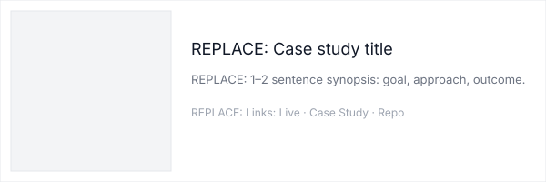

<!--
	README template scaffold for a professional GitHub profile.
	Replace marked sections (strings that start with "REPLACE:") with your real content.
	- Images are stored in /assets as SVG placeholders; replace with your optimized PNG/GIF/SVG files.
	- Badges use shields.io links; swap or remove as desired.
	- All inline notes for manual edits are inside HTML comments like <!-- REPLACE: ... -->

<!-- # Adam To -->

_I'm a web developer with 2 years of experience who leverages an intersectional cultural background to improve communication between technical and creative teams, actualizing moving websites with accessible features for diverse audiences._

<!-- REPLACE contact info below -->
**Contact:** [REPLACE/OMIT?: email@example.com](mailto:REPLACE:email@example.com) · [REPLACE WITH DOMAIN: Website](https://example.com) · [REPLACE WITH DRIVE PDF?: Resume](https://example.com) · [LinkedIn](https://www.linkedin.com/in/adam-to-915569264/)

---

<!-- ## Overview / Quick Links
-- Portfolio: [is this redundant?](https://example.com)
-- Resume: [Upload resume to a private host or link via contact form — see notes below] [ask benjie abt this]
-- Recent case study: [REPLACE: Project Name — short descriptor](#)
-- Demo: [REPLACE: Live Music Demo or visual demo](#) -->

## Skills + Languages
- Frontend: HTML5, CSS3, Tailwind, JavaScript, Electron
- Backend: Python, Java, SQL
- Tools: Figma, Git/GitHub, SquareSpace, Adobe Creative Cloud (Photoshop, Illustrator, Indesign, Premiere Pro)
- Other: UX Research (user interviews and usability testing), Project Management

<!-- Example badge (swap username/repo and styles as needed) -->
<!--  -->

## Featured Projects
|  | **CleanTap**, a Responsive idle game for charity:water | **DevilPhish**, a Cybersecurity Phishing Awareness Platform | Website Development for **Upcoming Wellness** |
|---|---|---|---|
| **Mockup** |  |  |  |
| **Description** |  — REPLACE: 2–3 line impact-oriented description. |  — REPLACE: Description emphasizing outcome. | UX-focused website design — REPLACE: Design integration and outcome. |
| **Tech** |   |  |  |
| **Links** | [Live](https://aato1.github.io/charitywaterprototype/) · [Case Study](#) · [Repo](https://github.com/aato1/charitywaterprototype) | [Case Study](#) · [Thesis Publication](#) | [Case Study](#) · [Repo](https://github.com/aato1/obfusc_wellness) |

## More About Me!
- **On a more personal note,** I'm always trying to learn new creative hobbies! Right now it's guitar and photography, to supplement my love of singing and hiking.
-[add more here?]

<!-- ## Most Recent
- REPLACE: Most Recent Project Name — one-line description and link: [Link](#) -->

<!-- ## Current Focus & Passions
- Open to: REPLACE: senior frontend roles, contract UX engineering
- Exploring: REPLACE: generative UI animations, Web Audio, accessibility tooling

## Dynamic / Personality Widget
-- Live music / mood demo: REPLACE: Link to demo (add animated GIF or live screenshot)
-- GitHub stats (optional):  -->

<!-- ## Logistics
-- Resume: Available on request — contact: [LinkedIn](https://www.linkedin.com/in/adam-to-915569264/)
-- Location / remote: Arizona, MST — open to remote / overlapping US hours
-- Hiring status: Open to work -->

---

<!-- ## Replaceable items & notes (condensed)
- Full name and title
- Email, website, LinkedIn
- Hero image (./assets/hero.svg) — replace with optimized PNG/GIF/SVG in same path
- Case-study mockup (./assets/case_mockup.svg) — replace with screenshot image
- Project names, descriptions, links
- GitHub username for readme-stats
- Resume PDF link -->

<!--
	Quick replacement guide:
	- Swap REPLACE: strings with real text.
	- Replace SVG placeholders in /assets with your own images (use same filenames or update paths).
	- For badges, use https://shields.io/ to create consistent badges.
	- Keep images optimized: PNG/WebP for static, GIF for short animations (<= ~3MB recommended).
-->

Thanks for visiting!
<!-- — contact: [REPLACE: email@example.com](mailto:REPLACE:email@example.com) -->

<!-- Privacy & resume-hosting notes: -->
<!--
	- To reduce scraping, avoid placing your email or resume as raw links on a public README.
	- Options: host resume behind a contact form, provide resume on request (mailto link triggers form), or use an image/PDF stored in a private bucket and serve via an authenticated link.
	- If you must link a resume, use a lightweight redirect or form (e.g., Netlify/Forms, Formspree) so crawlers can't easily harvest the file URL.
	- For contact: consider an obfuscated email (image or JS obfuscation on your website) or rely on LinkedIn messages until you want direct inquiries.
-->

